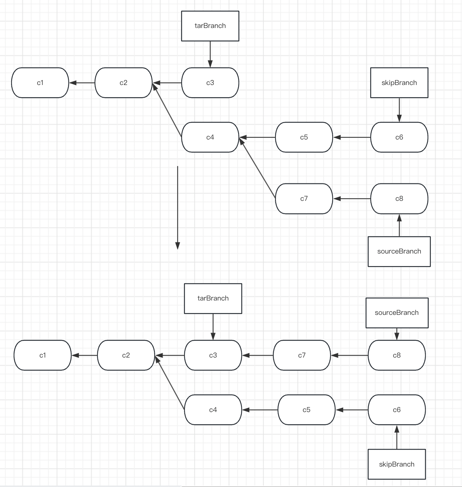

# 目录
- [1. Git 基础](#git-基础)
	- [1.1. Git 初始化](#git-初始化)
		- [1.1.1. 配置信息](#1-配置信息)
		- [1.1.2. 建立工作区](#2-建立工作区)
	- [1.2. Git 提交](#git-提交)
	- [1.3. Git 撤销操作](#git-撤销操作)	
	- [1.4. Git 清理](#git-清理)
	- [1.4. Git 远程仓库](#git-远程仓库)
	- [1.5. Git 标签](#git-标签)
- [2. Git 分支](#git-分支)
	- [2.1. Git 分支简介](#1-git-分支简介)
		- [2.1.1. Git 分支的创建](#1-git-分支的创建) 
		- [2.1.2. Git 分支切换](#2-git-分支切换)
	- [2.2. Git 分支合并与删除](#2-git-分支切换)
	- [2.3	Git 冲突合并](#3-git-冲突合并)
	- [2.4	Git 分支管理](#4-git-分支管理)
	- [2.5	Git 远程分支](#5-git-远程分支)
	- [2.6 	Git 变基](#6-变基)
- [3. 服务器上的 Git](#服务器上的-git)
	- [3.1 协议](#1-协议)
		- [3.1.1 协议的分类](#1-协议的分类)
	- [3.2 生成SSH公钥/私钥](#2-生成-ssh-公钥)


# Git 基础

## Git 初始化

### 1. 配置信息
- 配置全局用户信息
	```shell
	git config --global user.name "XXX"
	git config --global user.email 12345678@git.com
	```
- 查看配置信息
	```shell
	#查看指定的属性
	git config --global user.name
	#查看全部属性
	git config --global -l
	```
-  当前工作区的配置信息
	```shell
	#设置当前工作区的用户名
	git config user.name "XXX"
	#查看当前工作区的邮箱
	git config emil
	#查看当前工作区的全部配置信息
	git config -l
	```

### 2. 建立工作区
```shell
#在当前所在的目录下创建工作区
git init
#在当前所在的目录下创建目标文件夹，并在目标文件夹中创建工作区
git init targetFile
```

## Git 提交
- status 命令: 查看当前工作区修改状态
	 ```shell
	git status
	# 以紧凑的格式输出
	git status --short
	git status -s
	```
	
- add 命令: 对指定文件开始跟踪 或 将改动加入下次commit中(加入暂存区)
	```shell
	git add .
	```
	
- .gitignore: 总会有些文件无需纳入 Git 的管理，也不希望它们总出现在未跟踪文件列表，可以使用``.gitignore``文件来管理。可以在  https://github.com/github/gitignore 中找到各个语言的``.gitignore``

- diff 命令: 查看文件修改细节

   ```shell
   #查看未暂存的文件修改
   git diff
   #查看已加入暂存区的文件修改
   git diff --staged
   ```

- commit 命令: 生成一次commit

   ```shell
   git commit -m "commit信息"
   #启动文本编辑器，输入提交说明
   git commit
   #设置默认编辑软件
   git config --global core.editor vim
   #把所有已经跟踪过的文件暂存起来一并提交，从而跳过 git add 步骤
   git commit -a
   ```

- rm 命令: 将改动从暂存区移除

  ```shell
  #当文件已被删除，不希望继续被跟踪
  git rm
  #当强制将文件从暂存区移除，并删除该文件
  git rm -f
  #将文件从暂存区移除，放到未暂存区域
  git rm --cached
  ```

- mv 命令: 移动或重命名文件

  ```shell
  git mv xxx.xxx xxx
  ```

- log 命令: 查看提交历史

  ```shell
  #默认不用任何参数的话，git log 会按提交时间列出所有的更新，最近的更新排在最上面
  git log
  #显示每次提交的内容差异
  git log -p
  #显示最近*(数字1/2/3/4/5/6……)次提交
  git log -2
  #显示简略的统计信息
  git log --stat
  #仅在提交信息后显示已修改的文件清单
  --name-only
  #显示新增、修改、删除的文件清单
  --name-status
  #使用较短的相对时间显示（比如，“2 weeks ago”)
  --relative-date
  #按照时间限制
  --since 和 --until
  #按照作者搜索
  --author
  #按照commit提交关键字
  --grep
  #按照修改中的字符串或函数引用
  -S function_name
  #按照路径搜索(使用--分隔其他选项，放最后)
  git log --author xxx -- (路径)
  ```

## Git 撤销操作
- git commit --amend: 提交完了才发现漏掉了几个文件没有添加，或者提交信息写错了
  例如，我提交完成后，发现少提交一个``A文件``,则可以

  ```shell
  #将 A文件 加入暂存区
  git add A
  #输入提交信息重新提交
  git commit --amend
  ```

- 取消暂存: git restore --staged <file>

  ```shell
  #创建两个文件
  touch 1.log
  touch 2.log
  #全部加入暂存区
  git add *
  #将2.log取消暂存
  git restore --staged 2.log
  ```

- 取消未暂存区的修改：git restore <file>

  ```shell
  #修改某个文件
  vi 1.log
  #取消文件修改
  git restore 1.log
  ```

## Git 清理
  <font color=#C7254E>``git clean``</font> 命令用来从你的工作目录中删除所有没有tracked过的文件。
  | 命令    				         | 说明                                                          |
  |----------------------------------------------|--------------------------------------------------------------|
  | <font color=#C7254E>``git clean -n``</font>  | 告诉你哪些文件会被删除. 记住他不会真正的删除文件, 只是一个提醒。          |
  | <font color=#C7254E>``git clean -d``</font>  | 删除未跟踪的目录                   |
  | <font color=#C7254E>``git clean -f``</font>  | 删除当前目录下所有没有track过的文件。忽略文件不被删除！                               |
  | <font color=#C7254E>``git clean -df``</font> | -d代表删除目录，-f强制删除。                                                          |
  | <font color=#C7254E>``git clean -xf``</font> | 删除当前目录下所有没有track过的文件. 不管他是否是.gitignore文件里面指定的文件夹和文件 |
  | <font color=#C7254E>``git clean -X``</font>  | 删除所有被忽略的文件                                                                  |

  ```shell
#让当前工作目录回滚到上一次提交的状况，新添加的文件也被删除掉。

# 让暂存区和工作目录把已经被跟踪的文件清理干净
  $ git reset --hard
# 让未追踪的文件进行清理
  $ git clean -f
  ```


## Git 远程仓库

### 1. 查看远程仓库

- git remote: 列出已配置的远程服务器的简写

  ```shell
  🕙15:48:34 ❯ git remote
  origin
  ```

- git remote -v : 列出已配置的远程服务器的简写，以及对应的URL

  ```shell
  🕙15:48:36 ❯ git remote -v                                           
  origin	git@github.com:FergusAAA/Notes.git (fetch)
  origin	git@github.com:FergusAAA/Notes.git (push)
  ```

- git remote show [remote-name] : 查看指定远程服务器的详细信息

  ```shell
  🕙17:53:39 ❯ git remote show github
  * remote github
    Fetch URL: git@github.com:FergusAAA/Notes.git
    Push  URL: git@github.com:FergusAAA/Notes.git
    HEAD branch: master
    Remote branch:
      master tracked
    Local ref configured for 'git push':
      master pushes to master (local out of date)
  ```

### 2. 添加远程仓库及数据同步

- git remote add <shortname> <url> : 添加一个新的远程 Git 仓库，同时指定一个简写

  ```shell
  111 on master 
  🕙16:00:57 ❯ git remote   
  
  111 on master 
  🕙16:00:59 ❯ git remote add github git@github.com:FergusAAA/Notes.git
  
  111 on master 
  🕙16:08:36 ❯ git remote                                              
  github
  
  111 on master 
  🕙16:08:40 ❯ git remote -v                                           
  github	git@github.com:FergusAAA/Notes.git (fetch)
  github	git@github.com:FergusAAA/Notes.git (push)
  ```

- git fetch [remote-name] : 更新所有远程分支的引用

- git pull : 服务器上抓取数据并自动尝试合并到当前所在的分支

- git push [remote-name] [branch-name] : 推送到指定服务器的指定分支上

### 3. 远程仓库的其他操作

- git remote rename <old> <new> : 远程仓库的简写重命名

  ```shell
  111 on  master took 5s 
  🕙17:53:56 ❯ git remote            
  github
  
  111 on  master 
  🕙18:04:14 ❯ git remote rename github gh
  
  111 on  master 
  🕙18:04:23 ❯ git remote                 
  gh
  ```

- git remote rm <name> : 移除远程仓库


## Git 标签

## 1. 展示标签

- git tag : 已字母顺序列出标签

- git show <tag> : 展示标签信息与对应的提交信息

## 2. 创建标签

- git tag <tagName> [SHA] : 创建轻量标签
- git tag - a <tagName> [-m] [msg] [SHA] : 创建附注标签

## 3. 共享标签

- git push <remote> <tagName> : 将指定标签推送到远程指定仓库
- git push <remote> --tags : 将所有tag都推送都远程仓库


# Git 分支

## 1. Git 分支简介

> 实际上是一个指向提交对象的指针

### 1. Git 分支的创建

> 创建分支，实际就是在当前提交对象上创建一个指针

- git branch <branchName> : 基于当前提交创建分支

### 2. Git 分支切换

- git checkout <branchName> : ``切换``到指定分支
- git checkout -b <branchName> : ``新建`` 并 ``切换``到指定分支，是 git branch <branchName> 和 git checkout <branchName> 的简写


## 2. Git 分支合并与删除

- git merge <branchName> : 如果当前分支在指定分支的上游，那么只会移动指针，将指针指向目标分支所在的提交；如果两个分支分叉开，那么 git 就会自动选择一个祖先提交作为基础，创建一次三方合并

  

- git branch -d <branchName> : 删除指定分支

- git branch -D <branchName> : 强制删除指定分支，因为分支如果包含未合并到当前分支的提交，删除会失败，所以需要强制删除


## 3. Git 冲突合并

> 当两个提交修改了同一个文件位置，git 无法快速合并时，冲突就发生了，此时需要手动合并冲突

```shell
#合并产生冲突
111 on  master 
🕙19:40:27 ❯ git merge test  
Auto-merging xxx.xxx
CONFLICT (content): Merge conflict in xxx.xxx
Automatic merge failed; fix conflicts and then commit the result.
#查看冲突文件
111 on  master (MERGING) [=] 
🕙19:40:38 [🔴 ERROR] ❯ git status    
On branch master
You have unmerged paths.
  (fix conflicts and run "git commit")
  (use "git merge --abort" to abort the merge)

Unmerged paths:
  (use "git add <file>..." to mark resolution)
	both modified:   xxx.xxx

no changes added to commit (use "git add" and/or "git commit -a")
#手动合并
111 on  master (MERGING) [=] 
🕙19:40:47 ❯ vi xxx.xxx
#提交合并改动
111 on  master (MERGING) [=] 
🕙19:42:31 ❯ git add xxx.xxx 

111 on  master (MERGING) [+] 
🕙19:42:43 ❯ git status     
On branch master
All conflicts fixed but you are still merging.
  (use "git commit" to conclude merge)

Changes to be committed:
	modified:   xxx.xxx


111 on  master (MERGING) [+] 
🕙19:42:46 ❯ git commit -m "git merge"     
[master c3cf240] git merge
```


## 4. Git 分支管理

### 1. 分支查看

- git branch : 当前所有分支的列表

- git branch -v : 查看每个分支最后一次提交

- git branch -vv : 查看每个本地分支，且包含更多的信息，如每一个分支正在跟踪哪个远程分支与本地分支是否是领先、落后或是都有

  ```shell
  #如果想统计最新的领先或者落后信息
  git fetch remote
  git branch -vv
  ```

- git branch --merged : 当前已经合并到当前分支的分支

- git branch --no-merged : 当前尚未合并到当前分支的分支


## 5. Git 远程分支

### 1. 分支跟踪

- git checkout -b <branch> <remotenameBranch> : 基于远程分支``新建`` 并 ``切换``到指定分支

### 2. 拉取

- git fetch <remoteName> : 拉取指定的仓库，更新远程仓库的引用，但不会更新到本地分支

- git merge <remoteBranch> : 将远程分支的改动合入本地分支

- git pull <remoteName> <remoteBranch>:<branch> :  实际是将 ``git fetch`` 和 ``git merge`` 两个命令合并使用

### 3. 删除远程分支

- git push origin --delete <branchName> : 删除远程分支


## 6. 变基

- git rebase <branchName> : 将与 ``最近同祖 `` 的差异提交，全部移动到目标分支最后一次提交之后

- git rebase --onto <tarBranch> <skipBranch> <sourceBranch> : 取出 ``sourceBranch分支``，找出处于 ``sourceBranch分支``和 `` skipBranch分支``的共同祖先之后的修改，然后把它们在  ``tarBranch 分支`` 上重放一遍

  


# 服务器上的 Git

## 1. 协议

### 1. 协议的分类

- 本地协议：就是硬盘的另一个目录（例如一个挂载的NFS），难配置，且每个用户都拥有完整的 shell 权限
- HTTP协议：
	- 优点：使用 HTTP 协议的好处是易于架设。几条必要的命令就可以让全世界读取到仓库的内容。花费不过几分钟。HTTP 协议不会占用过多服务器资源。
	- 缺点：相对来说客户端效率更低。克隆或者下载仓库内容可能会花费更多时间，而且 HTTP 传输的体积和网络开销比其他任何一个协议都大。
- SSH协议：建设简单（很常见，大多数管理员都有经验），且访问安全
- Git协议：
	- 优点：是这几种网络传输协议中最快的
	- 缺点：缺乏授权机制


## 2. 生成 SSH 公钥
- b：指定密钥长度；
- e：读取openssh的私钥或者公钥文件；
- C：添加注释；
- f：指定用来保存密钥的文件名；
- i：读取未加密的ssh-v2兼容的私钥/公钥文件，然后在标准输出设备上显示openssh兼容的私钥/公钥；
- l：显示公钥文件的指纹数据；
- N：提供一个新密语；
- P：提供（旧）密语；
- q：静默模式；
- t：指定要创建的密钥类型。
```shell
#指定为rsa类型,注释加上邮箱，指定保存路径
ssh-keygen -t rsa -C xxx@xx.mail -f ~/.ssh/
#命令执行后会要求你输入两次密钥口令，如果不需要口令，将其留空即可
```

