# Kotlin

## 目录

-   [一、for循环](#一for循环)
-   [二、标准函数](#二标准函数)
    -   [1、let()](#1let)
    -   [2、with()](#2with)
    -   [3、run()](#3run)
    -   [4、apply()](#4apply)
-   [三、高阶函数](#三高阶函数)
    -   [1、语法结构](#1语法结构)
-   [四、委托](#四委托)
    -   [1、类委托](#1类委托)
    -   [2、属性委托](#2属性委托)
    -   [3、自定义lazy函数](#3自定义lazy函数)
-   [五、infix函数](#五infix函数)
    -   [1、语法](#1语法)
    -   [2、例子](#2例子)
-   [六、泛型的高级特性](#六泛型的高级特性)
    -   [1、对泛型进行实例化](#1对泛型进行实例化)
    -   [2、泛型的协变](#2泛型的协变)
-   [七、协程](#七协程)
    -   [1、协程创建——作用域构建器](#1协程创建——作用域构建器)
    -   [2、Flow](#2Flow)
       -   [(1)、Flow的介绍](#1Flow的介绍)
       -   [(2)、Flow的使用](#2Flow的使用)
       -   [(3)、StateFlow和SharedFlow](#3StateFlow和SharedFlow)


# 一、for循环

-   使用for in关键字
    ```kotlin
    for (item in array){
      
    }
    ```
-   repeat语法
    ```kotlin
    repeat(10){
      println(it) 
    }
    ```

# 二、标准函数

## 1、let()

```kotlin
val testString = "123"
//用于判断空
testString?.let {
    println(it)
}
```

## 2、with()

> 传入对象，在块内连续调用该对象的方法，让代码变得更加整洁

```kotlin
val list = 0 until 10
val num = with(StringBuilder()) {
    for (i in list) {
        append(i).append("\n")
    }
    //最后一行是函数的返回值
    toString()
}
println(num)
```

## 3、run()

> 功能与with()函数相同

```kotlin
val list = 0 until 10
val num = StringBuilder().run {
    for (i in list) {
        append(i).append("\n")
    }
    //最后一行是函数的返回值
    toString()
}
println(num)
```

## 4、apply()

> 用法与run()函数基本一致，区别在于最后一行不是返回值，返回值为对象本身

```kotlin
val list = 0 until 10
val num: StringBuilder = StringBuilder().apply {
    for (i in list) {
        append(i).append("\n")
    }
}
println(num.toString())
```

# 三、高阶函数

> 一个函数接受另一个函数作为参数，获取返回值类型是另一个函数

## 1、语法结构

ClassName.(String, Int) → Uint

```kotlin
fun example(func: (String, Int) -> Unit) {
  func("hello",123)
}
```

# 四、委托

> 操作对象不会自己不会去处理某段逻辑，而是会把工作委托给另一个辅助对象去处理

## 1、类委托

> 将一个类的具体实现委托给另一个类去完成

```kotlin
class MySet<T>(private val helperSet: HashSet<T>) : Set<T> by helperSet {

    fun helloWorld() = println("hello world")

    override fun isEmpty() = false
}
```

## 2、属性委托

> 将一个属性的具体实现委托给另一个类去完成

```kotlin
class MyClass {
    val p by Delegate()
}

class Delegate {
    private var propValue: Any? = null
    operator fun getValue(myClass: MyClass, prop: KProperty<*>): Any? {
        return propValue
    }

    operator fun setValue(myClass: MyClass, prop: KProperty<*>, value: Any?) {
        propValue = value
    }
}

```

## 3、自定义lazy函数

```kotlin
class Later<T>(val block: (T) -> T) {
    private var value: T? = null

    @Synchronized
    operator fun getValue(myClass: Any?, prop: KProperty<*>): T? = value?.let { block(it) }

    @Synchronized
    operator fun setValue(myClass: Any?, prop: KProperty<*>, value: T?) {
        this.value = value?.let { block(it) }
        println(this.value)
    }
}
//顶层函数
fun <T> later(block: (T) -> T) = Later(block)

class Person(name: String, private val age: Int) {
    var name: String? by later {
        it + "123"
    }

    init {
        this.name = name
    }
}

fun main() {
    val person = Person("xgd", 123)
    println(person.name)
}
```

# 五、infix函数

## 1、语法

infix 函数不能定义成顶层函数，它必须是某个类的成员函数，可以使用拓展函数的方式将它定义到某个类中；其次，infix函数必须且只能接收一个参数，这个参数的类型是没有限制的

## 2、例子

```kotlin
fun main() {
    val xgd = Person("xgd", 12)
    if (xgd be "xgd") {
        println("123")
    }
}

class Person(private var name: String, private var age: Int) {
    infix fun be(myName:String) = myName==this.name
}
```

# 六、泛型的高级特性

## 1、对泛型进行实例化

> 可以将内联函数中的泛型进行实例化(使用inline关键字)；在声明泛型的地方必须加上reified关键字来表示泛型要进行实例化

```kotlin
fun main() {
    val type1 = getGenericType<String>()
    var type2 = getGenericType<Int>()
    println("$type1 $type2")
}

inline fun <reified T> getGenericType() =T::class.java
```

## 2、泛型的协变

> 假如定义了一个MyClass\<T>的泛型类，其中A是B的子类型，同时MyClass\<A>是MyClass\<B>的子类型，那么可以称MyClass在T这个泛型上是协变的

```kotlin
fun main() {
    var student = SimpleData<Student>(Student())
    handleSimpleData(student)
}

fun handleSimpleData(data: SimpleData<Person>) {
    var get = data.get()
}

class SimpleData<out T>(private val data: T) {
    fun get(): T {
        return data
    }
}

open class Person {

}

class Student : Person() {

}
```

# 七、协程

> 在编程语音层面实现并发编程，不依赖于操作系统调度

## 1、协程创建——作用域构建器

1.  GlogalScope.launch——创建一个顶层协层作用域
2.  runBlocking——创建一个协层作用域，但是会阻塞当前线程，会影响性能
3.  launch——在当前作用域下创建一个子作用域
4.  coroutineScope——可以在任何挂起函数中调用，并继承当前作用域并创建子作用域，与runBlocking类似，但仅会阻塞当前协程


## 2、Flow

 ### 1)、Flow的介绍

​	Flow 是 google 官方提供的一套基于 kotlin 协程的响应式编程模型，它与 RxJava 的使用类似，但相比之下 Flow 使用起来更简单，另外 Flow 作用在协程内，可以与协程的生命周期绑定，当协程取消时， Flow 也会被取消，避免了内存泄漏风险。


 ### 2)、Flow的使用

1. Flow的创建

   > 当Flow创建后会提供协程上下文给Lambda表达式，因此可以在Lambda中调用挂起函数

   ```kotlin
   //直接通过flow()函数来创建一个flow
   val flow = flow {
   	emit(1)
   }
   
   //通过flowOf()函数来创建一个flow
   //会直接将内部元素发射出去
   val flow = flowOf(1,2,3,4)
   
   //通过asFlow()函数来创建一个flow
   val flow = listOf(1,2,3,4)
   	.asFlow()
   ```

   


  2. Flow的调用

     > Flow是冷流，即 不进行观察则不会运行

     ```kotlin
     /**
      * 使用上面创建的flow来调用
      */
     //使用collect()方法来注册观察flow
     //需要注意的collect()也是挂起函数，必须要在协程或者挂起函数中调用
     flow.collect {
       println(it.toString)
     }
     
     //使用collectLatest()函数来观察flow
     //这个函数用来处理Flow的背压问题，当新数据来的时候会将collectLatest中正在执行的  代码全部停掉，直接执行新的数据
     flow.collectLatest {
       println(it.toString)
     }
     ```

     


3. Flow的常用操作符
   - map 转换操作符
   
     ```kotlin
     fun main() {
         runBlocking {
             val flow = flowOf(1, 2, 3, 4, 5)
             flow.map {
               	//将每个元素转换后再输出
                 it * it
             }.collect {
                 println(it)
             }
         }
     }
     ```
   
   - filter 过滤操作符
   
     ```kotlin
     fun main() {
         runBlocking {
             val flow = flowOf(1, 2, 3, 4, 5)
             flow.filter { 
               	//只有偶数能通过，奇数无法通过，用来过滤偶数
                 it % 2 == 0
             }.map {
               	//转换成对应的平方
                 it * it
             }.collect {
                 println(it)
             }
         }
     }
     ```
   
   - onEach 遍历操作符
   
     ```kotlin
     fun main() {
         runBlocking {
             val flow = flowOf(1, 2, 3, 4, 5)
             flow.onEach {
               	//把flow中的每一条数据打印出来
                 println(it)
             }.collect {
             }
         }
     }
     ```
   
   - debounce 间隔操作符
   
     ```kotlin
     fun main() {
         runBlocking {
             flow {
                 emit(1)
                 emit(2)
                 delay(600)
                 emit(3)
                 delay(100)
                 emit(4)
                 delay(100)
                 emit(5)
             }
           	//只有两条消息之间的间隔大于500毫秒才能发射出来	
             .debounce(500)
             .collect {
                 println(it)
             }
         }
     }
     ```
   
     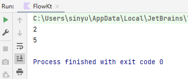
     
   - sample操作符:数据流当中按照一定的时间间隔来采样某一条数据
   
     ```kotlin
     flow {
     	while (true) {
     		emit("发送一条弹幕")
     	}
     }
     .sample(1000)
     .flowOn(Dispatchers.IO)
     .collect {
     	println(it)
     }
     ```
   
     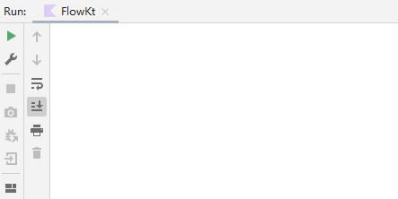
   
   - reduce终端操作符，不需要通过collect函数来收集结果
   
     ```kotlin
     val result = flow {
         for (i in (1..100)) {
             emit(i)
         }
     }.reduce { acc, value -> acc + value}
     println(result)
     ```
   
     用来计算累加
   
     
   
   - fold，与reduce操作符基本一致，多一个默认开头
   
     ```kotlin
     val result = flow {
         for (i in ('A'..'Z')) {
             emit(i)
         }
     }.fold("Alphabet: ") { acc, value -> acc + value}
     println(result)
     ```
   
   
   
   - flatMapConcat：和RxJavad flatMap类似，需要在lambda表达式返回一个Flow，可以实现嵌套操作
   
     ```kotlin
     flowOf(1, 2, 3)
             .flatMapConcat {
                 flowOf("a$it", "b$it")
             }
             .collect {
                 println(it)
             }
     ```
   
     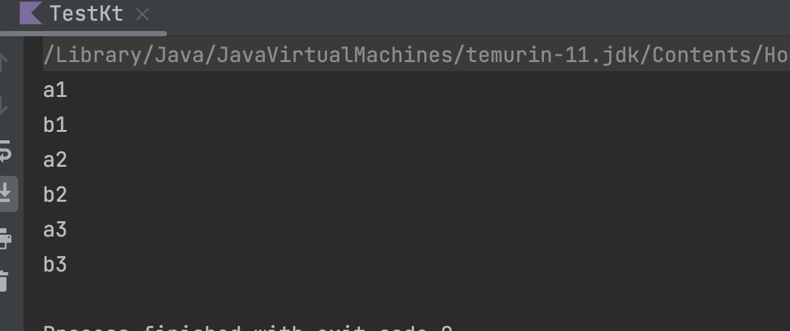
   
   - flatMapMerge：与flatMapConcat类似，区别在于，不能保证顺序
   
     ```kotlin
     flowOf(200, 100, 300)
             .flatMapMerge {
                 flow{
                     delay(it.toLong())
                     emit("a$it")
                     emit("b$it")
                 }
             }
             .collect {
                 println(it)
             }
     ```
   
     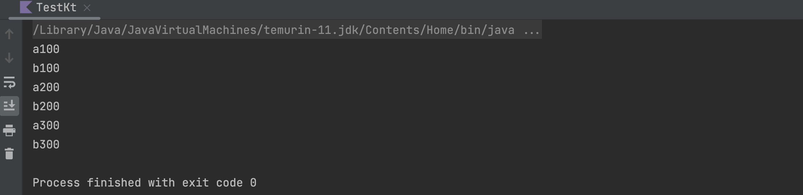由此可见flatMapMerge是谁先执行完先发送，不保证顺序
   
     
   
   - flatMapLatest:和上面类似，但是只会接受最新的数据，当新数据到的时候，会将原来的直接取消掉
   
     ```kotlin
     flow {
         emit(1)
         delay(150)
         emit(2)
         delay(50)
         emit(3)
     }.flatMapLatest {
         flow {
             delay(100)
             emit(it)
         }
     }.collect{
         println(it)
     }
     ```
   
     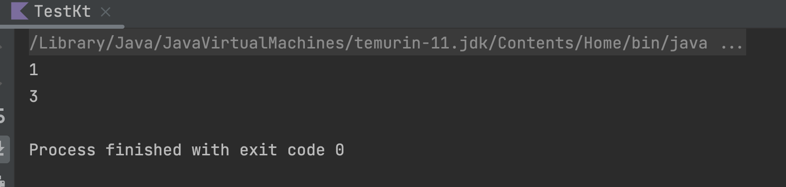
   
     因为2发送50毫秒后就发送了3，此时，flatMapLatest中的任务还没有执行完，所以直接被取消了
   
     
   
   - zip操作符：将多个Flow并行处理，注意的是，每个Flow发射的数据量要相同，多的则不会处理
   
     ```kotlin
     val start = System.currentTimeMillis()
     val flow1 = flow {
         delay(3000)
         emit("a")
     }
     val flow2 = flow {
         delay(2000)
         emit(1)
     }
     flow1.zip(flow2) { a, b ->
         a + b
     }.collect {
         val end = System.currentTimeMillis()
         println("Time cost: ${end - start}ms")
     }
     ```
   
     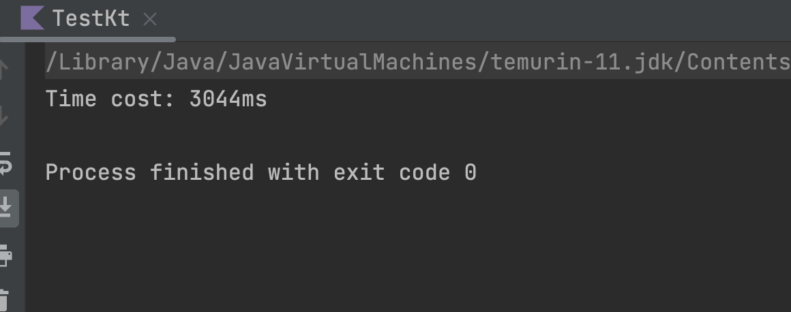
   
     
   
   - buffer操作符：可以将collect函数和flow函数运行在不同的协程中。正常情况下，collect函数和flow函数会运行在同一个协程当中，因此collect函数中的代码没有执行完，flow函数中的代码也会被挂起等待。所以会出现以下情况：
   
     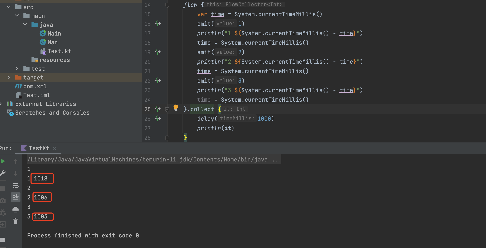
   
     发送没有时间间隔，但是却要等1000mm左右。
   
     当我们使用buffer操作符：collect函数将不会影响flow函数的调用
   
     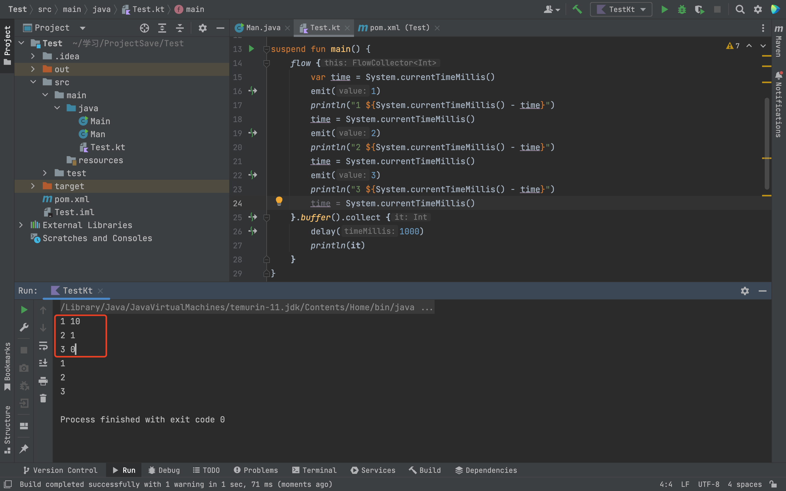
   
     实际上，buffer只是提供了一个缓存策略，flow只管发送数据，当数据超过collect的处理速度时，就会被存入缓存中，collect再从缓存区获取数据。但是当，流速差异过大，缓存区不够用时，buffer就不是很管用了，就需要丢弃一些数据。
   
     
   
   - conflate操作符：与collectLatest()非常像，都是当新数据到来时丢弃原来的数据，区别在与，collectLatest()函数会将过时数据的处理也一并取消掉，而conflate() 会让正在执行的操作执行完，然后直接去取新的数据做新的操作
   
     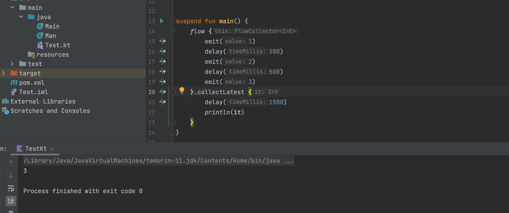
   
     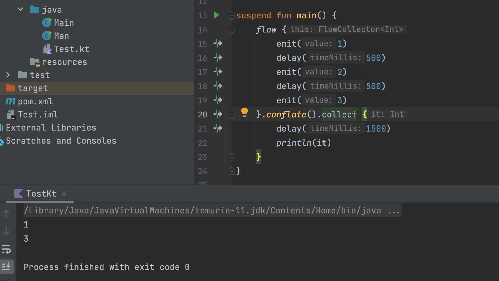


### 3)、StateFlow和SharedFlow

> 在说StateFlow和SharedFlow之前，我要说一下冷和热的概念。
>
> 在RxJava中就有冷热的区别，Flow作为RxJava的继任者，自然不会丢了这个

1. 冷流：只有被观察时才会运行，可以看成一个方法，每次调用都会返回结果。普通的Flow就是冷流

   ```kotlin
       val flow = flow {
           emit(1)
           emit(2)
           emit(3)
       }
       runBlocking {
           launch {
               flow.collect {
                   println(it)
               }
           }
           delay(500)
           println("do something")
           delay(500)
           launch {
               flow.collect {
                   println(it)
               }
           }
       }
   ```

   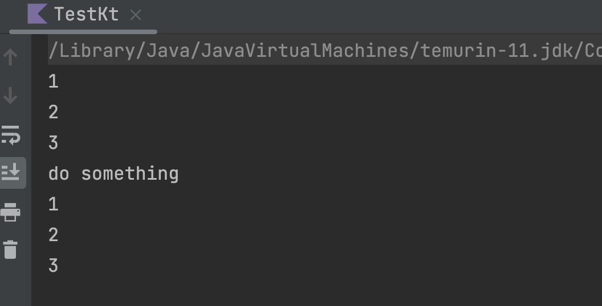

2. 热流：创建后就会开始工作，类似LiveData

   ```kotlin
   val flow = MutableStateFlow (1)
   runBlocking {
       launch {
           flow.collect {
               println(it)
           }
       }
       delay(500)
       println("do something")
       flow.value = 2
       delay(500)
       flow.value = 3
   }
   ```

   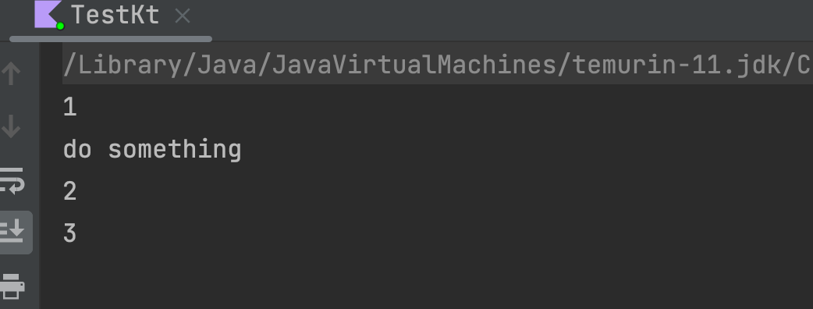

​	

3. StateFlow：和LiveData很相似，完全可以用来替代LiveData，且功能更强大。如果需要在协程中使用数据或对数据进行流处理，推荐使用StateFlow；如果功能非常简单，推荐使用LiveData。

   ```Kotlin
   //StateFlow初始化时需要设置默认值
   val stateFlow =	 MutableStateFlow(1)
   
   //设置新数据时，直接用value赋值
   stateFlow.value = 2
   
   //StateFlow观察时会直接拿到最新的值,需要注意是否要过滤默认值
   stateFlow.collect {
     	println(it)
   }
   ```

   用下面的例子看一下：

   ```kotlin
   val mutableStateFlow = MutableStateFlow(1)
   GlobalScope.launch {
       mutableStateFlow.collect {
           println(it)
       }
   }
   delay(500)
   mutableStateFlow.value = 2
   delay(500)
   mutableStateFlow.value = 3
   delay(500)
   ```

   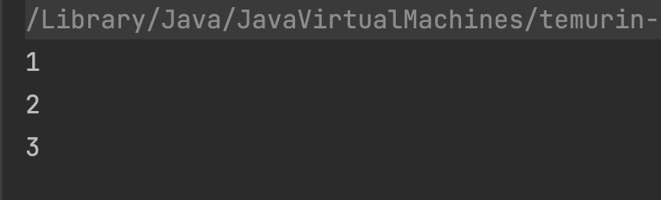
   
   
   
   如果想要将一个普通的Flow转换成StateFlow，可以使用stateIn()函数：
   
   ```kotlin
   //stateIn()有两个重载函数，第一个只需要传入一个协程作用域
   //第二个，需要作用域，超时时长，转变成StateFlow后的默认值，这里不过多介绍，有兴趣可以自行查阅
   GlobalScope.launch {
           flowOf.stateIn(this, SharingStarted.WhileSubscribed(1000), 0).collect {
               println(it)
           }
       }
   ```


